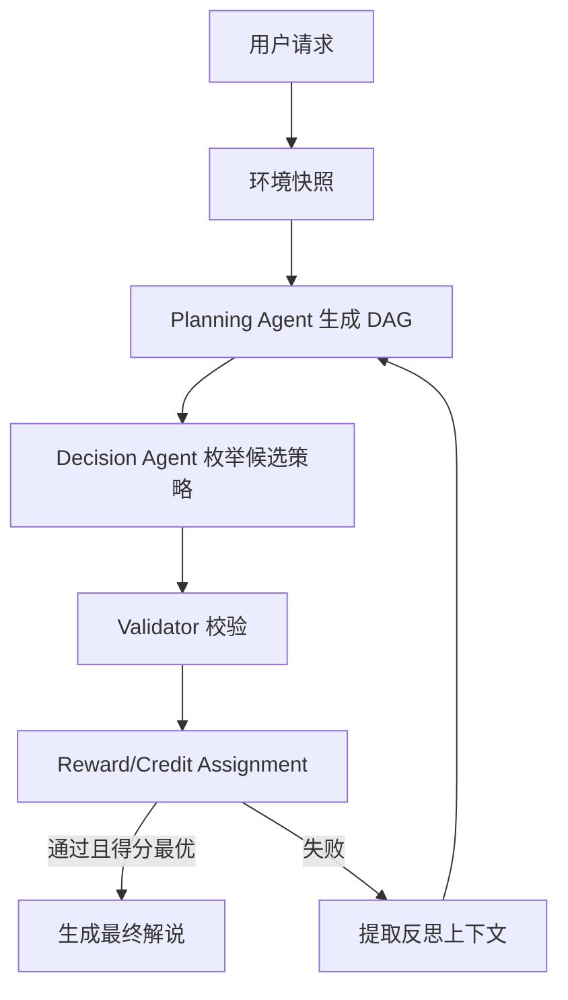

# 智能体中枢：规划-决策-反思 (PDR) 架构详解

## 1. 架构概述

本项目把地图智能体拆成三段，并在三段之上叠加一个轻量强化学习策略层：

1. `Planning Agent`
   把用户自然语言需求拆成任务 DAG。
2. `Decision Agent`
   注入环境事实，形成可执行的路线/出行方案。
3. `Reflection Agent`
   在校验失败时带着错误上下文回退重试。

系统不是让大模型直接端到端吐最终答案，而是让模型负责语义规划，再由代码负责约束校验、执行计划生成和策略学习。

## 2. 三层职责

### Planning

- 输入：用户请求、环境快照、上一轮反思信息。
- 输出：`PlanningDAG`
- 责任：覆盖信息采集、约束提取、候选路线搜索、风险校验和输出节点。

### Decision

- 输入：`PlanningDAG` + `EnvironmentSnapshot`
- 输出：`ExecutionPlan`
- 责任：根据天气、封控、限速、续航和车辆属性形成阶段化执行方案。

### Reflection

- 输入：`ValidationReport`
- 输出：新的反思上下文，再次触发 Planning
- 责任：把错误从“模型看不懂的坏结果”翻译成“模型能修正的明确约束”。

### Reinforcement Layer

- 输入：候选执行策略、校验结果、可选用户反馈。
- 输出：策略打分、信用分配、更新后的策略价值估计。
- 责任：让系统不只是“会反思”，还会在相似场景里逐步偏向更优策略。

## 3. 当前代码中的对应位置

- `pipelines/agent_core.py`
  整个 PDR 闭环的编排器。
- `services/amap_client.py`
  提供环境事实与执行计划。
- `services/llm_client.py`
  负责 DAG 生成与解说生成。
- `services/validator.py`
  负责结构和物理约束校验。
- `services/reward_policy.py`
  负责奖励函数、信用分配和策略记忆更新。
- `schemas/`
  固定所有层之间的数据接口。

## 4. 工作流

## 5. 设计取舍

- 没有 `AMAP_API_KEY` 时，系统使用 mock 环境继续跑通主链路。
- 没有在线 LLM 时，系统用规则回退生成基础 DAG，不让服务直接失效。
- 校验器优先保证“不胡说”和“不过物理线”，即使这意味着某些请求最终会返回 `failed`。
- 当前学习层采用轻量价值表和探索奖励，先把奖励函数与信用分配机制跑通，后续可以再升级成 DQN/A3C/Actor-Critic 一类策略网络。
